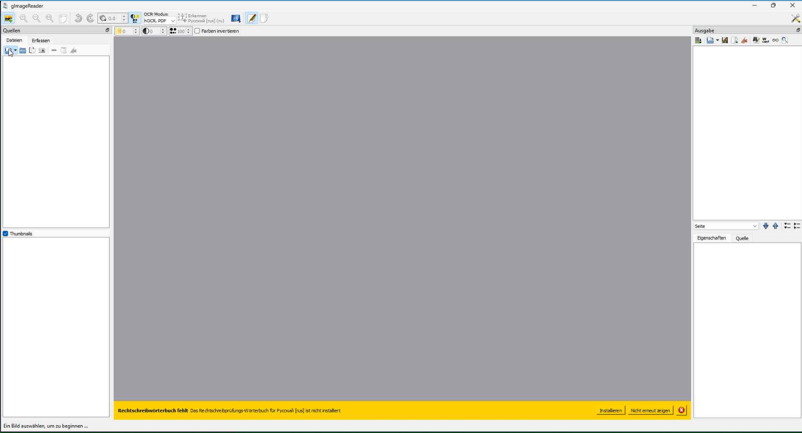
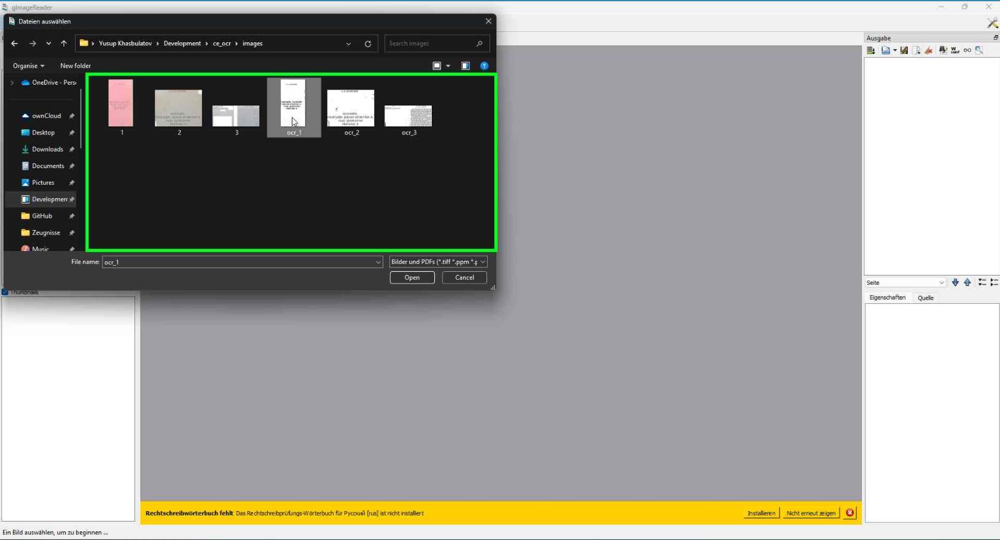
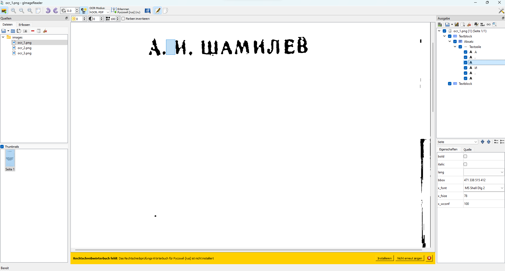

# Collection of useful scripts and guides for Chechen language OCR

## Image preprocessing
Before starting with box editing using gImageReader, you need to preprocess the images. Use the following script to do that:

`image_preprocessor.py` - script for image preprocessing. It can be used to convert images to grayscale, binarize them, and remove noise.

Put all the images you want to preprocess in the `images` folder. Then run the script:

`python image_preprocessor.py`

The script will create a new images with prefix `ocr_` in the `images` folder.

## Box editing
After preprocessing the images, you can start editing the boxes using gImageReader.

`gImageReader` - GUI tool for box editing. It can be used to edit the boxes and export them to a `html` file.

1. Open gImageReader and import the images from the `images` folder with the `ocr_` prefix.

2. Edit the boxes. Note that you need to select the character as word, not as a line.

3. Export the boxes to a `html` file and save them under the `html_box` folder.
4. Extract the boxes from the `html` file using the `box_extractor.py` script.

`box_extractor.py` - script for extracting the boxes from the `html` file exported by gImageReader.

